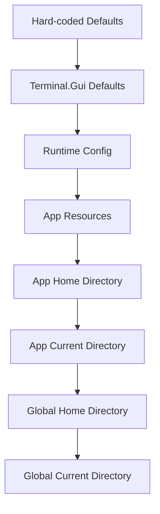

# Configuration Management

Terminal.Gui provides persistent configuration settings via the [`ConfigurationManager`](~/api/Terminal.Gui.Configuration.ConfigurationManager.yml) class.

## Configuration Lexicon and Taxonomy

[!INCLUDE [Config Lexicon](~/includes/config-lexicon.md)]

# Fundamentals

The `ConfigurationManager` class provides a way to store and retrieve configuration settings for an application. The configuration is stored in JSON documents, which can be located in the user's home directory, the current working directory, in memory, or as a resource within the application's main assembly.

Settings are defined in JSON format, according to this schema: https://gui-cs.github.io/Terminal.GuiV2Docs/schemas/tui-config-schema.json.

Terminal.Gui library developers can define settings in code and set the default values in the Terminal.Gui assembly's resources (e.g. `Terminal.Gui.Resources.config.json`).

Terminal.Gui application developers can define settings in their apps' code and set the default values in their apps' resources (e.g. `Resources/config.json`) or by setting @Terminal.Gui.Configuration.ConfigurationManager.RuntimeConfig to string containing JSON.

Users can change settings on a global or per-application basis by providing JSON formatted configuration files. The configuration files can be placed in at .tui folder in the user's home directory (e.g. `C:/Users/username/.tui`, or `/usr/username/.tui`) or the folder where the Terminal.Gui application was launched from (e.g. `./.tui`).

## CM is Disabled by Default

The `ConfigurationManager` must be enabled explicitly by calling @Terminal.Gui.Configuration.ConfigurationManager.Enable(Terminal.Gui.Configuration.ConfigLocations) in an application's `Main` method.

```csharp
// Enable configuration with all sources  
ConfigurationManager.Enable(ConfigLocations.All);
```

If `ConfigurationManager.Enable()` is not called (`ConfigurationManager.IsEnabled` is 'false'), all configuration settings are ignored and ConfigurationManager will effectively be a no-op. All `[ConfigurationProperty]` properties will initially be their hard-coded default values. 

Other than that, no other ConfigurationManager APIs will have any effect.

## Loading and Applying Configuration

Optionally, developers can more granularly control the loading and applying of configuration by calling the `Load` and `Apply` methods directly.

When a configuration has been loaded, the @Terminal.Gui.Configuration.ConfigurationManager.Apply method must be called to apply the settings to the application. This method uses reflection to find all static fields decorated with the `[ConfigurationProperty]` attribute and applies the settings to the corresponding properties.

```csharp
// Load the configuration from just the users home directory.
ConfigurationManager.Enable(ConfigLocations.HardCoded);
ConfigurationManager.Load(ConfigLocations.GlobalHome);
ConfigurationManager.Apply();
```

> [!IMPORTANT]
> Configuration Settings Apply at the Process Level. 
> Configuration settings are applied at the process level, which means that they are applied to all applications that are part of the same process. This is due to the fact that configuration properties are defined as static fields, which are static for the process.

## Configuration Types and Scopes

Terminal.Gui supports three main configuration scopes. See the section below titled [What Can Be Configured](#what-can-be-configured) for more details.

### SettingsScope

System-level settings that affect Terminal.Gui behavior:
```csharp
[ConfigurationProperty (Scope = typeof (SettingsScope))]
public static int MaxSearchResults { get; set; } = 10000;
```

### ThemeScope
Visual appearance settings that can be themed:
```csharp
 [ConfigurationProperty (Scope = typeof (ThemeScope))]
 public new static LineStyle DefaultBorderStyle { get; set; } = LineStyle.Single;
```

### AppSettingsScope (default)
Application-specific settings:
```csharp
[ConfigurationProperty] // AppSettingsScope is default
public static string MyAppSetting { get; set; } = "default";
```

## Configuration Precedence



Settings are applied using the following precedence (higher precedence settings overwrite lower precedence settings):

1. @Terminal.Gui.Configuration.ConfigLocations.HardCoded Hard-coded default values in any static property decorated with the `[ConfigurationProperty]` attribute.

2. @Terminal.Gui.Configuration.ConfigLocations.LibraryResources - Default settings in the Terminal.Gui assembly -- Lowest precedence.

3. @Terminal.Gui.Configuration.ConfigLocations.Runtime - Settings stored in the @Terminal.Gui.Configuration.ConfigurationManager.RuntimeConfig static property.

4. @Terminal.Gui.Configuration.ConfigLocations.AppResources - App settings in app resources (`Resources/config.json`).

5. @Terminal.Gui.Configuration.ConfigLocations.AppHome - App-specific settings in the users's home directory (`~/.tui/appname.config.json`). 

6. @Terminal.Gui.Configuration.ConfigLocations.AppCurrent - App-specific settings in the directory the app was launched from (`./.tui/appname.config.json`).

7. @Terminal.Gui.Configuration.ConfigLocations.GlobalHome - Global settings in the the user's home directory (`~/.tui/config.json`).

8. @Terminal.Gui.Configuration.ConfigLocations.GlobalCurrent - Global settings in the directory the app was launched from (`./.tui/config.json`) --- Hightest precedence.


The [`ConfigurationManager`](~/api/Terminal.Gui.Configuration.ConfigurationManager.yml) will look for configuration files in the `.tui` folder in the user's home directory (e.g. `C:/Users/username/.tui` or `/usr/username/.tui`), the folder where the Terminal.Gui application was launched from (e.g. `./.tui`), or as a resource within the Terminal.Gui application's main assembly.

Settings that will apply to all applications (global settings) reside in files named `config.json`. Settings that will apply to a specific Terminal.Gui application reside in files named `appname.config.json`, where *appname* is the assembly name of the application (e.g. `UICatalog.config.json`).


## Configuration Events

The ConfigurationManager provides several events to track configuration changes:

```csharp
// Called after configuration is applied
ConfigurationManager.Applied += (sender, e) => {
    // Handle configuration changes
};

// Called when the active theme changes
ConfigurationManager.ThemeChanged += (sender, e) => {
    // Handle theme changes
};
```


## How Settings are Defined 

Application developers define settings by decorating static properties with the `[ConfigurationProperty]` attribute.

```csharp
class MyApp
{
    [ConfigurationProperty]
    public static string MySetting { get; set; } = "Default Value";
}
```

Configuration Properties must be `public` or `internal` `static` properties.

The above example will define a configuration property in the `AppSettings` scope. The name of the property will be `MyApp.MySetting` and will appear in JSON as:

```json
{
    "AppSettings": {
      "MyApp.MySetting": "Default Value"
    }
}
```

`AppSettings` property names must be globally unique. To ensure this, the name of the AppSettings property is the name of the property prefixed with a period and the full name of the class that holds it. In the example above, the AppSettings property is named `MyApp.MySetting`.

Terminal.Gui library developers can use the `SettingsScope` and `ThemeScope` attributes to define settings and themes for the terminal.Gui library.

> [!IMPORTANT] 
App developers cannot define `SettingScope` or `ThemeScope` properties.

```csharp
    /// <summary>
    ///     Gets or sets whether <see cref="Button"/>s are shown with a shadow effect by default.
    /// </summary>
    [ConfigurationProperty (Scope = typeof (ThemeScope))]
    public static ShadowStyle DefaultShadow { get; set; } = ShadowStyle.None;
```

# Sample Code

The `UICatalog` application provides an example of how to use the [`ConfigurationManager`](~/api/Terminal.Gui.Configuration.ConfigurationManager.yml) class to load and save configuration files. 

The `Configuration Editor` Scenario provides an editor that allows users to edit the configuration files. UI Catalog also uses a file system watcher to detect changes to the configuration files to tell [`ConfigurationManager`](~/api/Terminal.Gui.Configuration.ConfigurationManager.yml) to reload them; allowing users to change settings without having to restart the application.

The `Themes` Scenario in the UI Catalog provides a viewer for the themes defined in the configuration files.

# What Can Be Configured

`ConfigurationManager` provides the following features:

1) **Settings**. Settings are applied to the [`Application`](~/api/Terminal.Gui.App.Application.yml) class. Settings are accessed via the `Settings` property of [`ConfigurationManager`](~/api/Terminal.Gui.Configuration.ConfigurationManager.yml). E.g. `Settings["Application.QuitKey"]`
2) **Themes**. Themes are a named collection of settings impacting how applications look. The default theme is named "Default". Two other built-in themes are provided: "Dark", and "Light". Additional themes can be defined in the configuration files. `Settings ["Themes"]` is a dictionary of theme names to theme settings.
3) **AppSettings**. Applications can use the [`ConfigurationManager`](~/api/Terminal.Gui.Configuration.ConfigurationManager.yml) to store and retrieve application-specific settings.

Methods for discovering what can be configured are available in the `ConfigurationManager` class:

- Call @Terminal.Gui.Configuration.ConfigurationManager.GetHardCodedConfig()
- Search the source code for `[ConfigurationProperty]` 

For complete schema details and examples, refer to:
- Schema: https://gui-cs.github.io/Terminal.GuiV2Docs/schemas/tui-config-schema.json
- Default configuration: Terminal.Gui/Resources/config.json

## Themes

A Theme is a named collection of settings that impact the visual style of Terminal.Gui applications. The default theme is named "Default". The built-in configuration within the Terminal.Gui library defines two more themes: "Dark", and "Light". Additional themes can be defined in the configuration files. The JSON property `Theme` defines the name of the theme that will be used. If the theme is not found, the default theme will be used.

Themes support defining Schemes (a set of colors and styles that define the appearance of views) as well as various default settings for Views. Both the default color schemes and user-defined color schemes can be configured. See [Schemes](~/api/Terminal.Gui.Drawing.Schemes.yml) for more information.

### Theme Configuration

Themes provide a way to bundle visual settings together. When @Terminal.Gui.Configuration.ConfigurationManager.Apply is called, the theme settings are applied to the application. 

```json
// ...
 "Dark": {
   "Dialog.DefaultButtonAlignment": "End",
   "Dialog.DefaultButtonAlignmentModes": "AddSpaceBetweenItems",
   "Dialog.DefaultBorderStyle": "Heavy",
   "Dialog.DefaultShadow": "Transparent",
   "FrameView.DefaultBorderStyle": "Single",
   "Window.DefaultBorderStyle": "Single",
   "MessageBox.DefaultButtonAlignment": "Center",
   "MessageBox.DefaultBorderStyle": "Heavy",
   "Button.DefaultShadow": "Opaque",
   "Schemes": [
     {
       "TopLevel": {
         "Normal": {
           "Foreground": "LightGray",
           "Background": "Black",
           "Style": "None"
         },
// etc...
```

Only properties that are defined in the theme will be applied, meaning that themes can be used to override the a previously applied theme.

To ensure a theme inherits from the default theme, first apply the default theme, then apply the new theme, like this:

```csharp
// Apply the default theme
  ThemeManager.Theme = "Default";
ConfigurationManager.Apply();

// Apply the new theme
ThemeManager.Theme = "MyCustomTheme";
ConfigurationManager.Apply();
```

### Glyphs

Themes support changing the standard set of glyphs used by views (e.g. the default indicator for [Button](~/api/Terminal.Gui.Views.Button.yml)) and line drawing (e.g. [LineCanvas](~/api/Terminal.Gui.Drawing.LineCanvas.yml)).


The value can be either a decimal number or a string. The string may be:

- A Unicode char (e.g. "☑")
- A hex value in U+ format (e.g. "U+2611")
- A hex value in UTF-16 format (e.g. "\\u2611")

```json
  "Glyphs.RightArrow": "►",
  "Glyphs.LeftArrow": "U+25C4",
  "Glyphs.DownArrow": "\\u25BC",
  "Glyphs.UpArrow": 965010
```

The `UI Catalog` application defines a `UICatalog` Theme. Look at the UI Catalog's `./Resources/config.json` file to see how to define a theme.

### Theme and Scheme Management

Terminal.Gui provides two key managers for handling visual themes and schemes:

The ThemeManager provides convenient methods for working with themes:

```csharp
// Get the currently active theme
ThemeScope currentTheme = ThemeManager.GetCurrentTheme();

// Get all available themes
Dictionary<string, ThemeScope> themes = ThemeManager.GetThemes();

// Get list of theme names
ImmutableList<string> themeNames = ThemeManager.GetThemeNames();

// Get/Set current theme name
string currentThemeName = ThemeManager.GetCurrentThemeName();
ThemeManager.Theme = "Dark"; // Switch themes

// Listen for theme changes
ThemeManager.ThemeChanged += (sender, e) => {
    // Handle theme changes
};
```

### SchemeManager

The SchemeManager handles schemes within themes. Each theme contains multiple schemes for different UI contexts:

```csharp
// Get current schemes
Dictionary<string, Scheme> schemes = SchemeManager.GetCurrentSchemes();

// Get list of scheme names
ImmutableList<string> schemeNames = SchemeManager.GetSchemeNames();

// Access specific schemes
Scheme topLevelScheme = SchemeManager.GetScheme("TopLevel");

// Listen for scheme changes
SchemeManager.CollectionChanged += (sender, e) => {
    // Handle scheme changes
};
```

### Built-in Schemes

The following Schemes are available by default:

- **TopLevel**: Used for the application's top-level windows
- **Base**: Default scheme for most views
- **Dialog**: Used for dialogs and message boxes
- **Menu**: Used for menus and status bars
- **Error**: Used for error messages and dialogs

Each Scheme defines the attributes for different VisualRoles.

## Application Settings

Terminal.Gui provides several top-level application settings:

```json
{
  "Key.Separator": "+",
  "Application.ArrangeKey": "Ctrl+F5",
  "Application.Force16Colors": false,
  "Application.IsMouseDisabled": false,
  "Application.NextTabGroupKey": "F6",
  "Application.NextTabKey": "Tab",
  "Application.PrevTabGroupKey": "Shift+F6",
  "Application.PrevTabKey": "Shift+Tab",
  "Application.QuitKey": "Esc"
}
```

### View-Specific Settings

Examples of settings that control specific view behaviors:

```json
{
  "PopoverMenu.DefaultKey": "Shift+F10",
  "FileDialog.MaxSearchResults": 10000,
  "FileDialogStyle.DefaultUseColors": false,
  "FileDialogStyle.DefaultUseUnicodeCharacters": false
}
```

### Key Bindings

> [!WARNING]
>  Configuration Manager support for key bindings is not yet implemented.

Key bindings are defined in the `KeyBindings` property of the configuration file. The value is an array of objects, each object defining a key binding. The key binding object has the following properties:

- `Key`: The key to bind to. The format is a string describing the key (e.g. "q", "Q,  "Ctrl+Q"). Function keys are specified as "F1", "F2", etc. 

# Error Handling

```json
{
  "ConfigurationManager.ThrowOnJsonErrors": false
}
```

Set to `true` to throw exceptions on JSON parsing errors instead of silent failures.

# Configuration File Schema

Settings are defined in JSON format, according to the schema found here:

https://gui-cs.github.io/Terminal.Gui/schemas/tui-config-schema.json

## The Default Config File

To illustrate the syntax, the below is the `config.json` file found in `Terminal.Gui.dll`:

[!code-json[config.json](../../Terminal.Gui/Resources/config.json)]