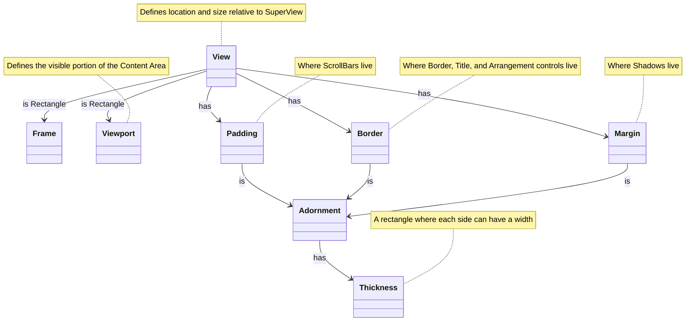

# Layout

Terminal.Gui provides a rich system for how [View](View.md) objects are laid out relative to each other. The layout system also defines how coordinates are specified.

See [View Deep Dive](View.md), [Arrangement Deep Dive](arrangement.md), [Scrolling Deep Dive](scrolling.md), and [Drawing Deep Dive](drawing.md) for more.

## Lexicon & Taxonomy

[!INCLUDE [Layout Lexicon](~/includes/layout-lexicon.md)]

## Arrangement Modes

See [Arrangement Deep Dive](arrangement.md) for more.

## Composition

[!INCLUDE [View Composition](~/includes/view-composition.md)]

## The Content Area

**Content Area** refers to the rectangle with a location of `0,0` with the size returned by @Terminal.Gui.ViewBase.View.GetContentSize*. 

The content area is the area where the view's content is drawn. Content can be any combination of the @Terminal.Gui.ViewBase.View.Text property, `SubViews`, and other content drawn by the View. The @Terminal.Gui.ViewBase.View.GetContentSize* method gets the size of the content area of the view. 

 The Content Area size tracks the size of the @Terminal.Gui.ViewBase.View.Viewport by default. If the content size is set via @Terminal.Gui.ViewBase.View.SetContentSize*, the content area is the provided size. If the content size is larger than the @Terminal.Gui.ViewBase.View.Viewport, scrolling is enabled. 

## The Viewport

The @Terminal.Gui.ViewBase.View.Viewport is a rectangle describing the portion of the **Content Area** that is visible to the user. It is a "portal" into the content. The `Viewport.Location` is relative to the top-left corner of the inner rectangle of `View.Padding`. If `Viewport.Size` is the same as `View.GetContentSize()`, `Viewport.Location` will be `0,0`. 

To enable scrolling call `View.SetContentSize()` and then set `Viewport.Location` to positive values. Making `Viewport.Location` positive moves the Viewport down and to the right in the content. 

See the [Scrolling Deep Dive](scrolling.md) for details on how to enable scrolling.

The @Terminal.Gui.ViewBase.View.ViewportSettings property controls how the Viewport is constrained. By default, the `ViewportSettings` is set to `ViewportSettings.None`. To enable the viewport to be moved up-and-to-the-left of the content, use `ViewportSettings.AllowNegativeX` and or `ViewportSettings.AllowNegativeY`. 

The default `ViewportSettings` also constrains the Viewport to the size of the content, ensuring the right-most column or bottom-most row of the content will always be visible (in v1 the equivalent concept was `ScrollBarView.AlwaysKeepContentInViewport`). To allow the Viewport to be smaller than the content, set `ViewportSettings.AllowXGreaterThanContentWidth` and/or `ViewportSettings.AllowXGreaterThanContentHeight`.

## Layout Engine

Terminal.Gui provides a rich system for how views are laid out relative to each other. The position of a view is set by setting the `X` and `Y` properties, which are of time @Terminal.Gui.ViewBase.Pos. The size is set via `Width` and `Height`, which are of type @Terminal.Gui.ViewBase.Dim.

```cs
var label1 = new Label () { X = 1, Y = 2, Width = 3, Height = 4, Title = "Absolute")

var label2 = new Label () {
    Title = "Computed",
    X = Pos.Right (otherView),
    Y = Pos.Center (),
    Width = Dim.Fill (),
    Height = Dim.Percent (50)
};
```

### @Terminal.Gui.ViewBase.Pos

@Terminal.Gui.ViewBase.Pos is the type of `View.X` and `View.Y` and supports the following sub-types:

* Absolute position, by passing an integer - @Terminal.Gui.ViewBase.Pos.Absolute*.
* Percentage of the parent's view size - @Terminal.Gui.ViewBase.Pos.Percent(System.Int32)
* Anchored from the end of the dimension - @Terminal.Gui.ViewBase.Pos.AnchorEnd(System.Int32)
* Centered, using @Terminal.Gui.ViewBase.Pos.Center*
* The @Terminal.Gui.ViewBase.Pos.Left*, @Terminal.Gui.ViewBase.Pos.Right*, @Terminal.Gui.ViewBase.Pos.Top*, and @Terminal.Gui.ViewBase.Pos.Bottom* tracks the position of another view.
* Aligned (left, right, center, etc...) with other views - @Terminal.Gui.ViewBase.Pos.Align*
* An arbitrary function - @Terminal.Gui.ViewBase.Pos.Func*

All `Pos` coordinates are relative to the SuperView's content area.

`Pos` values can be combined using addition or subtraction:

```cs
// Set the X coordinate to 10 characters left from the center
view.X = Pos.Center () - 10;
view.Y = Pos.Percent (20);

anotherView.X = AnchorEnd (10);
anotherView.Width = 9;

myView.X = Pos.X (view);
myView.Y = Pos.Bottom (anotherView) + 5;
```
### @Terminal.Gui.ViewBase.Dim

@Terminal.Gui.ViewBase.Dim is the type of `View.Width` and `View.Height` and supports the following sub-types:

* Automatic size based on the View's content (either SubViews or Text) - @Terminal.Gui.ViewBase.Dim.Auto* - See [Dim.Auto Deep Dive](dimauto.md).
* Absolute size, by passing an integer - @Terminal.Gui.ViewBase.Dim.Absolute(System.Int32).
* Percentage of the SuperView's Content Area  - @Terminal.Gui.ViewBase.Dim.Percent(System.Int32).
* Fill to the end of the SuperView's Content Area - @Terminal.Gui.ViewBase.Dim.Fill*.
* Reference the Width or Height of another view - @Terminal.Gui.ViewBase.Dim.Width(Terminal.Gui.ViewBase.View), @Terminal.Gui.ViewBase.Dim.Height(Terminal.Gui.ViewBase.View).
* An arbitrary function - @Terminal.Gui.ViewBase.Dim.Func(System.Func{System.Int32}).

All `Dim` dimensions are relative to the SuperView's content area.

Like, `Pos`, objects of type `Dim` can be combined using addition or subtraction, like this:

```cs
// Set the Width to be 10 characters less than filling 
// the remaining portion of the screen
view.Width = Dim.Fill () - 10;

view.Height = Dim.Percent(20) - 1;

anotherView.Height = Dim.Height (view) + 1;
```


