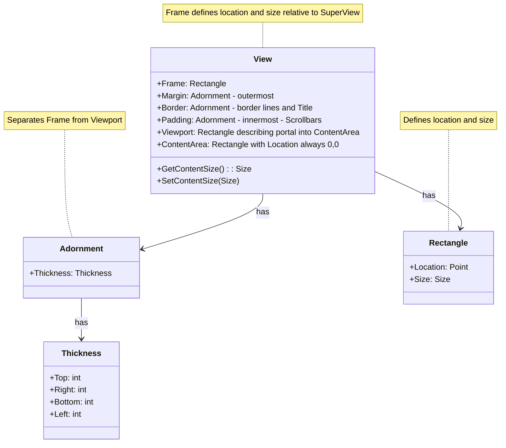

# View Composition Diagram

The diagram above shows the structure of a View's composition:

1. **Frame**: The outermost rectangle defining the View's location and size
2. **Margin**: Separates the View from other SubViews
3. **Border**: Contains visual border and title
4. **Padding**: Offsets the Viewport from the Border
5. **Viewport**: The visible portion of the Content Area
6. **Content Area**: Where the View's content is drawn (shown larger than Viewport to illustrate scrolling)

Each layer is defined by a Thickness that specifies the width of each side (top, right, bottom, left). The Content Area is shown as a separate container that the Viewport "looks into" - this illustrates how scrolling works. In this example, the Viewport is positioned at (5,5) relative to the Content Area, showing how scrolling works. 